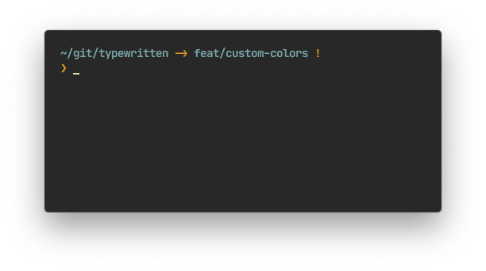

<p align="center">
  
</p>

<h1 align="center">typewritten</h1>

<p align="center">A minimal <a href="https://www.zsh.org/">zsh</a> prompt</p>

<br />

<p align="center">
  <a href="https://github.com/reobin/typewritten/blob/master/LICENSE">
    
  </a>
  <a href="https://github.com/reobin/typewritten/releases">
    
  </a>
  <a href="https://npmjs.com/package/typewritten">
    
  </a>
</p>
<p align="center">
  <a href="https://github.com/reobin/typewritten/stargazers">
    
  </a>
  <a href="https://github.com/reobin/typewritten/network/members">
    
  </a>
  <a href="#contributors">
    <!-- ALL-CONTRIBUTORS-BADGE:START - Do not remove or modify this section -->
    
<!-- ALL-CONTRIBUTORS-BADGE:END -->
  </a>
</p>

<p align="center">
  
</p>

> Terminal is [iTerm2](https://iterm2.com/) — Font is [JetBrains Mono](https://www.jetbrains.com/lp/mono/) — Terminal theme is [Seoul256](https://github.com/junegunn/seoul256.vim)

## Features

- Asynchronous git info
- Fully customizable
  - [Colors for any of the prompt sections](https://typewritten.dev/#/prompt_color_customization)
  - [Prompt layout](https://typewritten.dev/#/prompt_customization?id=typewritten_prompt_layout)
  - [Prompt symbol](https://typewritten.dev/#/prompt_customization?id=typewritten_symbol)
  - [Constant display of git home directory](https://typewritten.dev/#/prompt_customization?id=typewritten_git_relative_path)
  - [Cursor](https://typewritten.dev/#/prompt_customization?id=typewritten_cursor)
  - [Prefix on right prompt](https://typewritten.dev/#/prompt_customization?id=typewritten_right_prompt_prefix)

## Quick start

### [npm](https://npmjs.com/get-npm)

```shell
npm install -g typewritten
```

That's it. The script will make the necessary symlinks to `fpath` and set the prompt in your `.zshrc`.

### Manual

Clone the typewritten repository somewhere you can easily link. I recommend creating a `.zsh` directory at root.

```shell
mkdir -p "$HOME/.zsh"
git clone https://github.com/reobin/typewritten.git "$HOME/.zsh/typewritten"
```

Load typewritten in your `.zshrc` by using zsh prompinit:

```shell
fpath+=$HOME/.zsh/typewritten
autoload -U promptinit; promptinit
prompt typewritten
```

### Other ways to install

Many other ways to install typewritten are available in the [docs](https://typewritten.dev/#/installation)

## Customization

typewritten is customizable in many ways. To keep the readme file as lean as possible, the documentation was moved to [https://typewritten.dev](https://typewritten.dev).

The documentation is separated into two parts:

- [Prompt customization](https://typewritten.dev/#/prompt_customization), everything to do with how and where the info is displayed
- [Prompt color customization](https://typewritten.dev/#/prompt_color_customization), set a custom color for any of the prompt sections

**Example of 3 customized typewritten prompts**

<p align="center">
  
</p>
<p align="center">
  
  
</p>

## Contributors ✨

Thanks goes to these wonderful people ([emoji key](https://allcontributors.org/docs/en/emoji-key)):

<!-- ALL-CONTRIBUTORS-LIST:START - Do not remove or modify this section -->
<!-- prettier-ignore-start -->
<!-- markdownlint-disable -->
<table>
  <tr>
    <td align="center"><a href="https://github.com/reobin"><br /><sub><b>Robin Gagnon</b></sub></a><br /><a href="https://github.com/reobin/typewritten/commits?author=reobin" title="Code">💻</a> <a href="#maintenance-reobin" title="Maintenance">🚧</a> <a href="https://github.com/reobin/typewritten/commits?author=reobin" title="Documentation">📖</a></td>
    <td align="center"><a href="https://www.thbe.org/"><br /><sub><b>thbe</b></sub></a><br /><a href="https://github.com/reobin/typewritten/commits?author=thbe" title="Code">💻</a></td>
    <td align="center"><a href="http://erikreinertsen.com"><br /><sub><b>Erik Reinertsen</b></sub></a><br /><a href="https://github.com/reobin/typewritten/commits?author=erikr" title="Code">💻</a> <a href="https://github.com/reobin/typewritten/commits?author=erikr" title="Documentation">📖</a></td>
    <td align="center"><a href="https://twitter.com/artem_zin"><br /><sub><b>Artem Zinnatullin :slowpoke:</b></sub></a><br /><a href="https://github.com/reobin/typewritten/commits?author=artem-zinnatullin" title="Code">💻</a> <a href="https://github.com/reobin/typewritten/commits?author=artem-zinnatullin" title="Documentation">📖</a></td>
    <td align="center"><a href="https://nizarmah.me/"><br /><sub><b>Nizar</b></sub></a><br /><a href="https://github.com/reobin/typewritten/commits?author=nizarmah" title="Code">💻</a></td>
  </tr>
</table>

<!-- markdownlint-enable -->
<!-- prettier-ignore-end -->
<!-- ALL-CONTRIBUTORS-LIST:END -->

This project follows the [all-contributors](https://github.com/all-contributors/all-contributors) specification. Contributions of any kind welcome!

## Inspiration

`pure` layout is inspired by [Pure](https://github.com/sindresorhus/pure)

