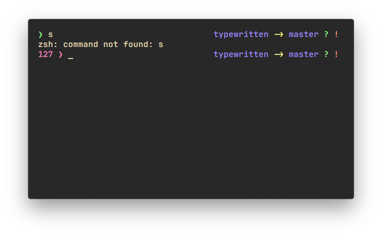
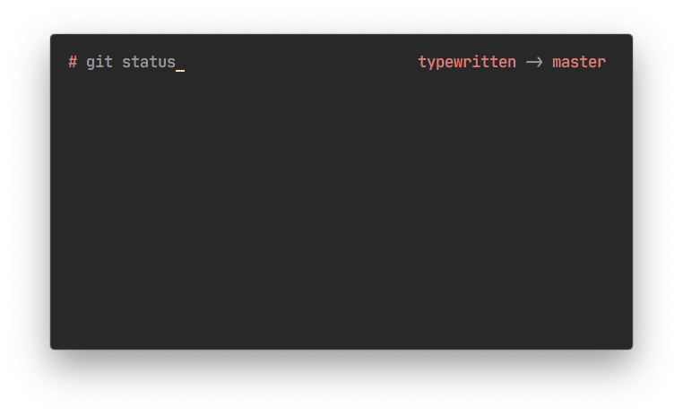
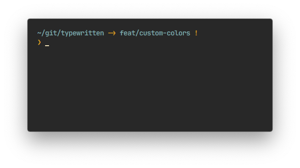
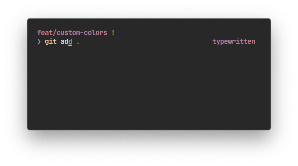

# Prompt color customization

All colors on the prompt are customizable. If colors for a section is not defined, the default one is used.

**[Jump to examples](#examples)**

## How to configure general colors

General color mappings are configured through `TYPEWRITTEN_COLOR_MAPPINGS`.

To ease the process of changing around the colors in typewritten, semantic names have been given to groups of sections.

| Name             | Section                                                                                      | Default value |
| ---------------- | -------------------------------------------------------------------------------------------- | ------------- |
| `primary`        | The current directory and git branch.                                                        | `magenta`     |
| `secondary`      | The prompt symbol.                                                                           | `blue`        |
| `accent`         | The arrow, the host-user connector, the virtual env, and the right prompt prefix.            | `default`     |
| `notice`         | The symbol when user is root                                                                 | `yellow`      |
| `info_negative`  | The symbol when there is an error, the return error code, and the git status deleted symbol. | `red`         |
| `info_positive`  | The git status staged symbol.                                                                | `green`       |
| `info_neutral_1` | The host, the user, and the git status stash and modified symbols.                           | `yellow`      |
| `info_neutral_2` | The git status new, diverged, ahead and behind symbols                                       | `blue`        |
| `info_special`   | The git status renamed and unmerged symbols.                                                 | `cyan`        |

### Variable format

These colors are configured through an environment variable named `TYPEWRITTEN_COLOR_MAPPINGS`.

Color for a semantic group is configured with key, being the group, and value being the color value. The two are separated by a colon (`:`).

For multiple custom colors, separate the key-values with semicolons (`;`).

A simple example would be:

```shell
# primary -> red
# current_directory -> #008080
export TYPEWRITTEN_COLOR_MAPPINGS="primary:red;secondary:#008080"
```

### Supported colors

- HEX colors (i.e.: `#008080`)
- 256 (xterm)
- `default` (foreground color)
- `black`
- `red`
- `green`
- `yellow`
- `blue`
- `magenta`
- `cyan`
- `white`

Named colors will follow your terminal color scheme.

## Customize the color of a single section

Precise section color mappings are configured through `TYPEWRITTEN_COLOR`.

To change the color of a single section, regardless of its semantic group, the `TYPEWRITTEN_COLORS` variable is used.

Both `TYPEWRITTEN_COLORS` and `TYPEWRITTEN_COLOR_MAPPINGS` use the same [format](#variable-format). Only the key values are different.

| Section               | Description                                                                                          | Default value |
| --------------------- | ---------------------------------------------------------------------------------------------------- | ------------- |
| `prompt`              | The input of the command line (what you write).                                                      | `default`     |
| `symbol`              | The prompt symbol.                                                                                   | `blue`        |
| `symbol_error`        | The prompt symbol when an error return code is detected.                                             | `red`         |
| `symbol_root`         | The prompt symbol when the user is root                                                              | `red`         |
| `error_code`          | The displayed error return code.                                                                     | `red`         |
| `git_branch`          | The current git branch.                                                                              | `magenta`     |
| `current_directory`   | The current directory and/or git home                                                                | `magenta`     |
| `arrow`               | The arrow between the current directory and the git branch (`->`).                                   | `default`     |
| `right_prompt_prefix` | When a right prompt prefix is set, it can be colored.                                                | `default`     |
| `host`                | The current host on `multiline` or `singleline_verbose` layouts.                                     | `yellow`      |
| `host_user_connector` | The `@` between host and user on `multiline` or `singleline_verbose` layouts.                        | `default`     |
| `user`                | The user between on `multiline` or `singleline_verbose` layouts.                                     | `yellow`      |
| `virtual_env`          | The current python virtual environment.                                                             | `default`     |
| `git_rebasing`        | The word `rebasing` replaces the git status when the current git repository in is currently rebasing | `magenta`     |
| `git_status_staged`   | The displayed `+` symbol coming from git status.                                                     | `green`       |
| `git_status_new`      | The displayed `?` symbol coming from git status.                                                     | `blue`        |
| `git_status_modified` | The displayed `!` symbol coming from git status.                                                     | `yellow`      |
| `git_status_renamed`  | The displayed `»` symbol coming from git status.                                                     | `cyan`        |
| `git_status_deleted`  | The displayed `—` symbol coming from git status.                                                     | `red`         |
| `git_status_unmerged` | The displayed `#` symbol coming from git status. (merge conflicts)                                   | `default`     |
| `git_status_diverged` | The displayed `~` symbol coming from git status. (branch has diverged from origin)                   | `blue`        |
| `git_status_ahead`    | The displayed `\|•` symbol coming from git status. (branch is ahead of origin)                       | `blue`        |
| `git_status_behind`   | The displayed `•\|` symbol coming from git status. (branch is behind of origin)                      | `blue`        |
| `git_status_stash`    | The displayed `$` symbol coming from git status.                                                     | `yellow`      |

Note: `TYPEWRITTEN_COLORS` values will always override the ones of `TYPEWRITTEN_COLOR_MAPPINGS`

## Examples

Here are some examples of configuring colors (and more) for the prompt:

### Example #1 (Dracula)

```shell
export TYPEWRITTEN_COLOR_MAPPINGS="primary:#9580FF;secondary:#8AFF80;accent:#FFFF80;info_negative:#FF80BF;info_positive:#8AFF80;info_neutral_1:#FF9580;info_neutral_2:#FFFF80;info_special:#80FFEA"
```

<p align="center">
  
</p>

### Example #2

```shell
export TYPEWRITTEN_SYMBOL="#"
export TYPEWRITTEN_COLOR_MAPPINGS="primary:red;secondary:red;accent:black;foreground:black"
```

<p align="center">
  
</p>

### Example #3

```shell
export TYPEWRITTEN_PROMPT_LAYOUT="pure"
export TYPEWRITTEN_COLOR_MAPPINGS="primary:blue"
export TYPEWRITTEN_COLORS="arrow:yellow;symbol:yellow"
```

<p align="center">
  
</p>

### Example #4 (wrong format)

```shell
export TYPEWRITTEN_PROMPT_LAYOUT="half_pure"
export TYPEWRITTEN_COLORS=";wrong_format:" # default values will be used
```

<p align="center">
  
</p>
