# Prompt customization

Here lie all the options related to how or where the information is displayed on the prompt.

Click on an option's name to see more info.

| Option                                                                                                                            | Description                                                                                    | Available options                                                         | Default value |
| --------------------------------------------------------------------------------------------------------------------------------- | ---------------------------------------------------------------------------------------------- | ------------------------------------------------------------------------- | ------------- |
| [TYPEWRITTEN_PROMPT_LAYOUT](#typewritten_prompt_layout)                                                                           | Defines how the prompt is displayed.                                                           | `singleline`, `half_pure` , `pure`, `singleline_verbose`, and `multiline` | `singleline`  |
| [TYPEWRITTEN_SYMBOL](#typewritten_symbol)                                                                                         | Defines the prompt symbol.                                                                     | Any string value                                                          | `❯`           |
| [TYPEWRITTEN_ARROW_SYMBOL](#typewritten_arrow_symbol)                                                                             | Defines the arrow symbol.                                                                      | Any string value                                                          | `->`          |
| [TYPEWRITTEN_RELATIVE_PATH](#typewritten_relative_path)                                                                           | Defines what the current directory display is relative to.                                     | `git`, `home`, `adaptive`, or `off`                                       | `git`         |
| [TYPEWRITTEN_CURSOR](#typewritten_cursor)                                                                                         | Defines the used cursor.                                                                       | `underscore`, `beam`, `block`, or `terminal`                              | `underscore`  |
| [TYPEWRITTEN_LEFT_PROMPT_PREFIX](#typewritten_left_prompt_prefix-and-typewritten_right_prompt_prefix)                             | Defines what is displayed just before the prompt symbol on the left.                           | Any string                                                                |               |
| [TYPEWRITTEN_LEFT_PROMPT_PREFIX_FUNCTION](#typewritten_left_prompt_prefix_function-and-typewritten_right_prompt_prefix_function)  | Defines what is displayed just before the prompt symbol on the left. Takes in a function name. | Any function name                                                         |               |
| [TYPEWRITTEN_RIGHT_PROMPT_PREFIX](#typewritten_left_prompt_prefix-and-typewritten_right_prompt_prefix)                            | Defines what is displayed just before the right part of the prompt.                            | Any string                                                                |               |
| [TYPEWRITTEN_RIGHT_PROMPT_PREFIX_FUNCTION](#typewritten_left_prompt_prefix_function-and-typewritten_right_prompt_prefix_function) | Defines what is displayed just before the prompt symbol on the left. Takes in a function name. | Any function name                                                         |               |

> All of these options are configurable through your `.zshrc` file like this:
>
> ```shell
> export TYPEWRITTEN_PROMPT_LAYOUT="singleline"
> ```

## TYPEWRITTEN_PROMPT_LAYOUT

**Default single line (`TYPEWRITTEN_PROMPT_LAYOUT="singleline"`)**

<p align="center">
  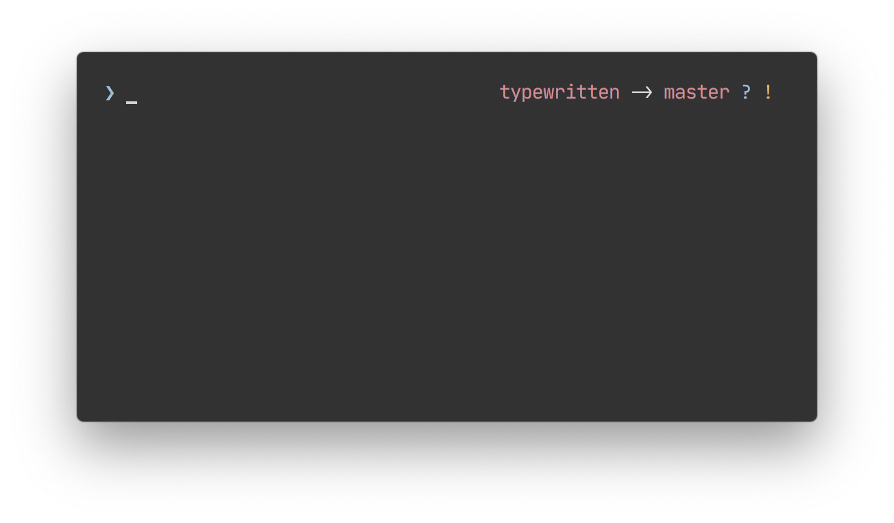
</p>

**Half pure (`TYPEWRITTEN_PROMPT_LAYOUT="half_pure"`)**

<p align="center">
  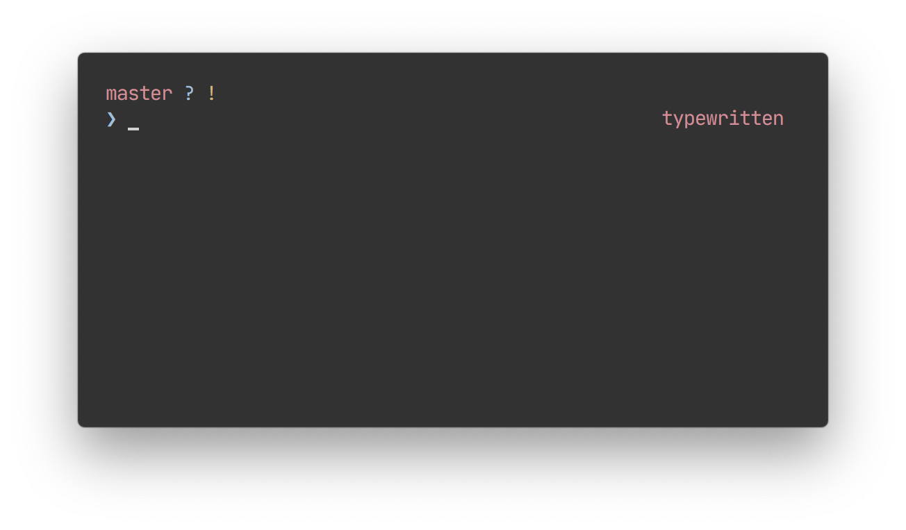
</p>

**[Pure](https://github.com/sindresorhus/pure) (`TYPEWRITTEN_PROMPT_LAYOUT="pure"`)**

<p align="center">
  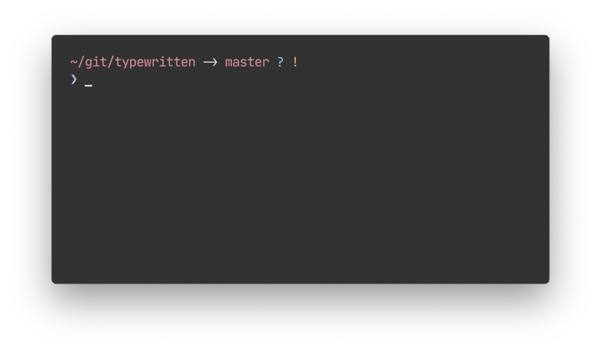
</p>

**Pure - verbose variation (`TYPEWRITTEN_PROMPT_LAYOUT="pure_verbose"`)**

<p align="center">
  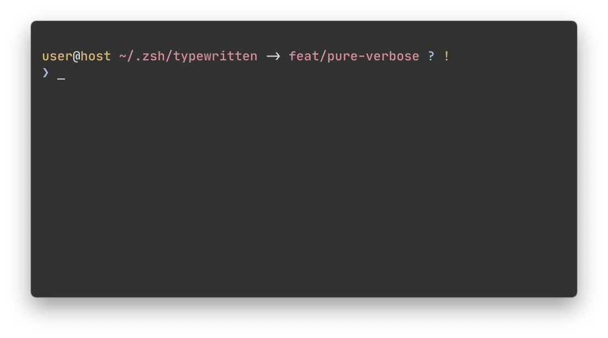
</p>

**Single line - verbose variation (`TYPEWRITTEN_PROMPT_LAYOUT="singleline_verbose"`)**

<p align="center">
  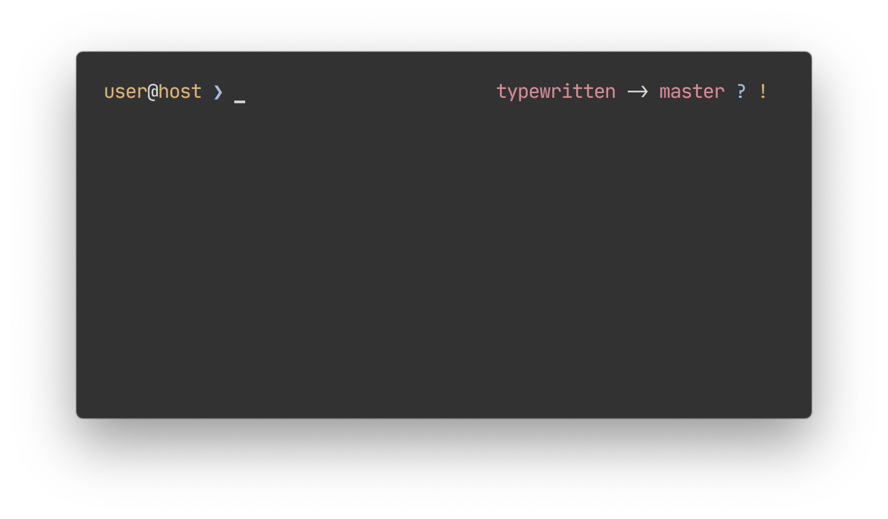
</p>

**Multiline (`TYPEWRITTEN_PROMPT_LAYOUT="multiline"`)**

<p align="center">
  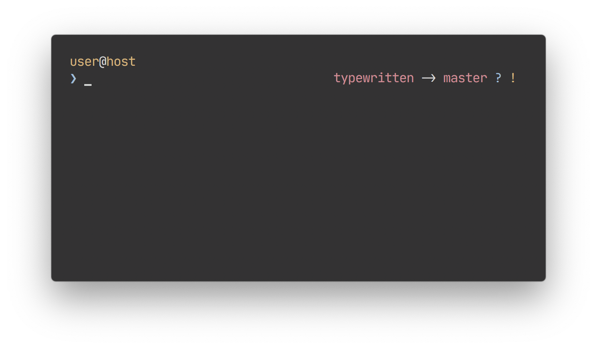
</p>

## TYPEWRITTEN_SYMBOL

Here are some examples of customized prompt symbols.

**Default (`TYPEWRITTEN_SYMBOL="❯"`)**

<p align="center">
  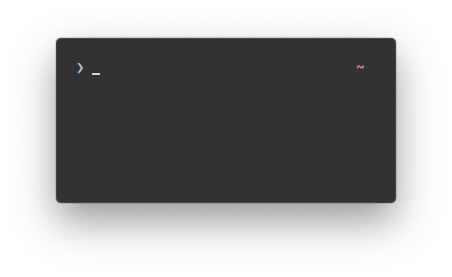
</p>

**Dollar sign (`TYPEWRITTEN_SYMBOL="$"`)**

<p align="center">
  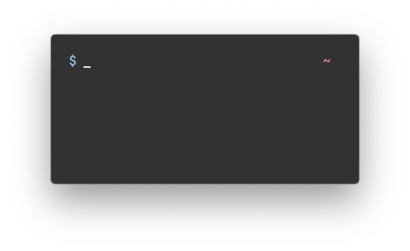
</p>

**Full arrow (`TYPEWRITTEN_SYMBOL="->"`)**

<p align="center">
  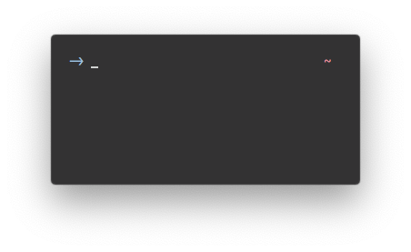
</p>

## TYPEWRITTEN_ARROW_SYMBOL

Here are some examples of customized prompt arrow symbols.

**Default (`TYPEWRITTEN_ARROW_SYMBOL="->"`)**

<p align="center">
  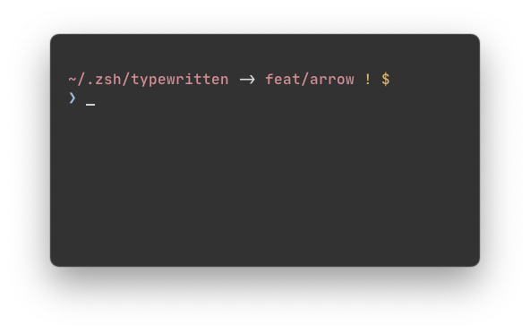
</p>

**Glyph arrow (`TYPEWRITTEN_ARROW_SYMBOL="➜"`)**

<p align="center">
  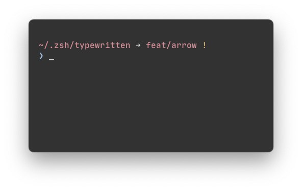
</p>

## TYPEWRITTEN_RELATIVE_PATH

By default, when in a git repository, the git root directory is always displayed no matter how far you are inside it.

**Default behaviour (`TYPEWRITTEN_RELATIVE_PATH="git"`)**

`/.../` is displayed when the nesting gets more than one level deep.

<p align="center">
  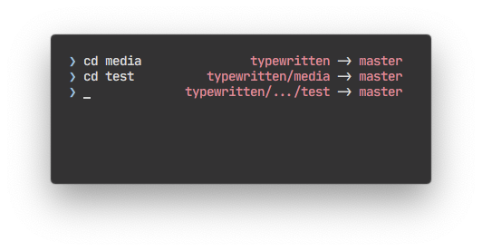
</p>

When outside of a git repository, only the basename of the current directory is displayed.

<p align="center">
 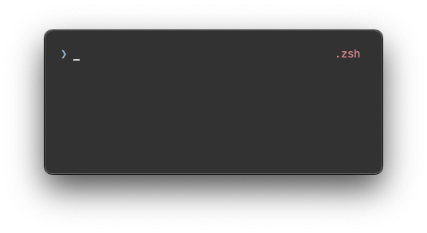
</p>

**Relative to `$HOME` (`TYPEWRITTEN_RELATIVE_PATH="home"`)**

When set to `home`, the full directory path relative to `$HOME` is displayed at all times.

<p align="center">
  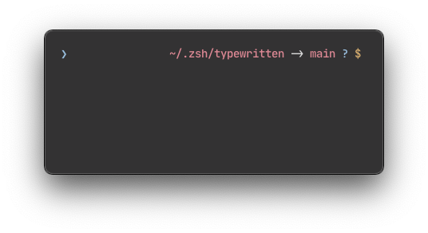
</p>

**Adaptive (`git` and `home`) (`TYPEWRITTEN_RELATIVE_PATH="adaptive"`)**

Adaptive display means that if you are in a git repository, the current directory will show the current path relative to the git root directory.

<p align="center">
  
</p>

If you are outside of a git repository, the path will be displayed relative to `$HOME`.

<p align="center">
  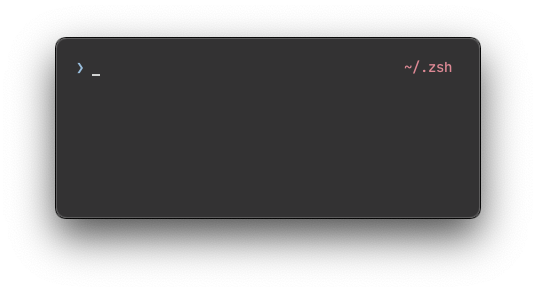
</p>

**Off (`TYPEWRITTEN_RELATIVE_PATH="off"`)**

This option being off means that at all times, the current directory display only shows the basename of the current directory.

<p align="center">
  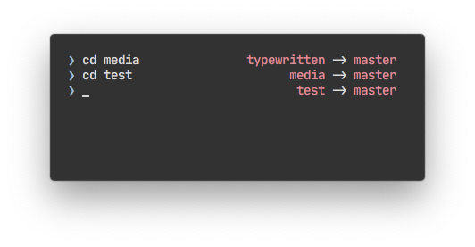
</p>

## TYPEWRITTEN_CURSOR

**Default underscore (`TYPEWRITTEN_CURSOR="underscore"`)**

<p align="center">
  
</p>

**Beam (`TYPEWRITTEN_CURSOR="beam"`)**

<p align="center">
  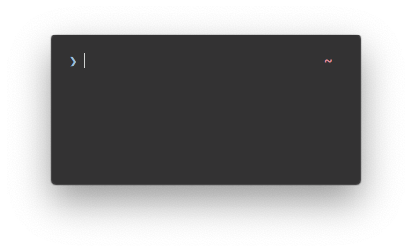
</p>

**Block (`TYPEWRITTEN_CURSOR="block"`)**

<p align="center">
  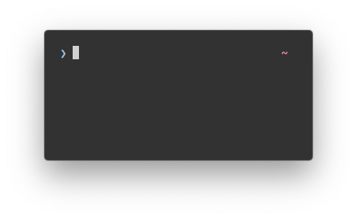
</p>

**Terminal (`TYPEWRITTEN_CURSOR="terminal"`)**

By using this option, typewritten stops managing cursor preference. The cursor used will be the one configured by your terminal emulator.

## TYPEWRITTEN_LEFT_PROMPT_PREFIX and TYPEWRITTEN_RIGHT_PROMPT_PREFIX

This option is stricly used as a string value. To use functions, take a look at [TYPEWRITTEN_LEFT_PROMPT_PREFIX_FUNCTION](#typewritten_left_prompt_prefix_function-and-typewritten_right_prompt_prefix_function).

**Display a string value**

```sh
export TYPEWRITTEN_RIGHT_PROMPT_PREFIX="# "
```

<p align="center">
  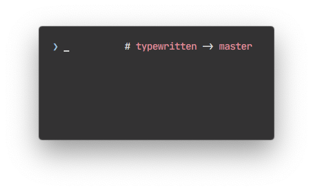
</p>

## TYPEWRITTEN_LEFT_PROMPT_PREFIX_FUNCTION and TYPEWRITTEN_RIGHT_PROMPT_PREFIX_FUNCTION

This variable should be assigned to a function name, and will be evaluated whenever the prompt is rendered.

### Display the `date`

Since `date` is a function name, it will execute and the output will be displayed as the prefix:

```sh
export TYPEWRITTEN_LEFT_PROMPT_PREFIX_FUNCTION=date
```

<p align="center">
  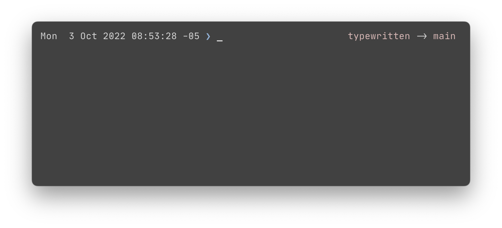
</p>

### Display `date` with options

To customize what the timestamp will look like, you can use options:

```sh
export TYPEWRITTEN_LEFT_PROMPT_PREFIX_FUNCTION=(date +%H:%M:%S)
```

<p align="center">
  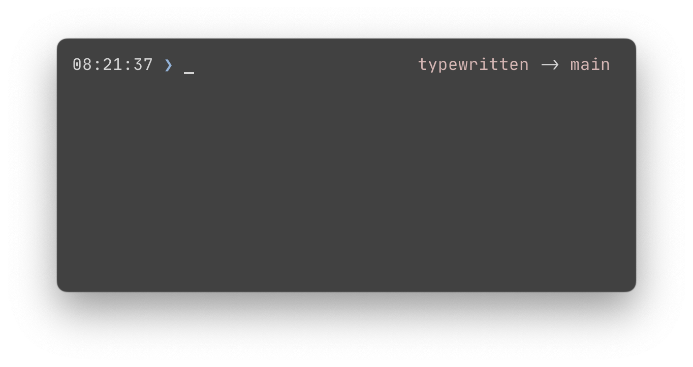
</p>

### Use a custom function

You can create your own function to display more complex values:

```sh
complex_time() {
  local time=$(date +%H:%M:%S)
  echo "time: $time"
}

export TYPEWRITTEN_LEFT_PROMPT_PREFIX_FUNCTION=complex_time
```

<p align="center">
  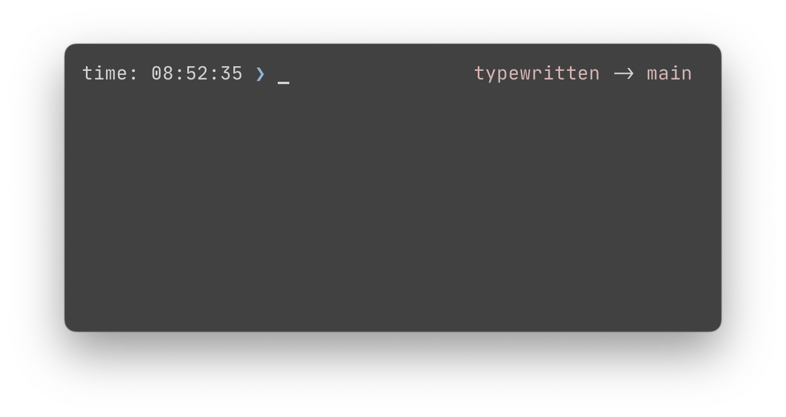
</p>

**Bonus example**

Display kube_context:

```sh
display_kube_context() {
  tw_kube_context="$(kubectl config current-context 2> /dev/null)"

  if [[ $tw_kube_context != "" ]]; then
    echo "($(basename $tw_kube_context))"
  fi
}

export TYPEWRITTEN_LEFT_PROMPT_PREFIX_FUNCTION=display_kube_context
```
