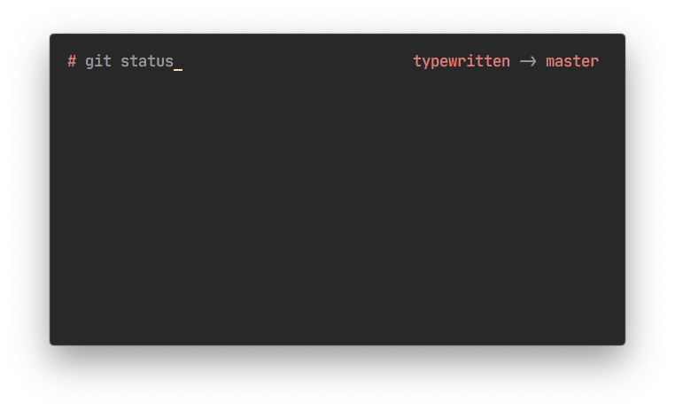
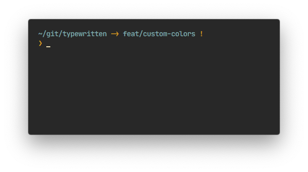
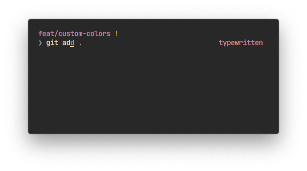

<h1 align="center">
  
  <p align="center">
    A minimal zsh prompt
  </p>
</h1>

<p align="center">
  <a href="https://github.com/reobin/typewritten/blob/master/LICENSE">
    
  </a>
  <a href="https://github.com/reobin/typewritten/releases">
    
  </a>
  <a href="https://npmjs.com/package/typewritten">
    
  </a>
  <a href="https://github.com/reobin/typewritten/stargazers">
    
  </a>
  <a href="https://github.com/reobin/typewritten/network/members">
    
  </a>
  <a href="https://github.com/reobin/typewritten/graphs/contributors">
    
  </a>
</p>

<p align="center">
  
</p>

> Terminal is [iTerm2](https://iterm2.com/) — Font is [JetBrains Mono](https://www.jetbrains.com/lp/mono/) — Terminal theme is [Seoul256](https://github.com/junegunn/seoul256.vim)

## Features

- Asynchronous git info
- Fully customizable
  - [Colors for any of the prompt sections](https://github.com/reobin/typewritten/wiki/Prompt-color-customization)
  - [Prompt layout](https://github.com/reobin/typewritten/wiki/Prompt-customization#typewritten_prompt_layout)
  - [Prompt symbol](https://github.com/reobin/typewritten/wiki/Prompt-customization#typewritten_symbol)
  - [Constant display of git home directory](https://github.com/reobin/typewritten/wiki/Prompt-customization#typewritten_git_relative_path)
  - [Cursor](https://github.com/reobin/typewritten/wiki/Prompt-customization#typewritten_cursor)
  - [Prefix on right prompt](https://github.com/reobin/typewritten/wiki/Prompt-customization#typewritten_right_prompt_prefix)

## Quick start

### [npm](https://npmjs.com/get-npm)

```shell
npm install -g typewritten
```

That's it. The script will make the necessary symlinks to `fpath` and set the prompt in your `.zshrc`.

### Manual

Clone the typewritten repository somewhere you can easily link. I recommend creating a `.zsh` directory at root.

```shell
mkdir -p "$HOME/.zsh"
git clone https://github.com/reobin/typewritten.git "$HOME/.zsh/typewritten"
```

Load typewritten in your `.zshrc` by using zsh prompinit:

```shell
fpath+=$HOME/.zsh/typewritten
autoload -U promptinit; promptinit
prompt typewritten
```

### Other ways to install

Many other ways to install typewritten are available in the [wiki](https://github.com/reobin/typewritten/wiki/Installation)

## Customization

typewritten is customizable in many ways. To keep the readme file as lean as possible, the documentation was moved to the [wiki](https://github.com/reobin/typewritten/wiki).

The documentation is separated into two parts:

- [Prompt customization](https://github.com/reobin/typewritten/wiki/Prompt-customization), everything to do with how and where the info is displayed
- [Prompt color customization](https://github.com/reobin/typewritten/wiki/Prompt-color-customization), set a custom color for any of the prompt sections

**Example of 3 customized typewritten prompts**

<p align="center">
  
</p>
<p align="center">
  
  
</p>

## Credits

### Contributors

A special thanks to all the contributors to this project

- [@thbe](https://github.com/thbe)
- [@erikr](https://github.com/erikr)
- [@artem-zinnatullin](https://github.com/artem-zinnatullin)
- [@nizarmah](https://github.com/nizarmah)
- [@jletey](https://github.com/jletey)
- [@pfandzelter](https://github.com/pfandzelter)
- [@eleven4y](https://github.com/eleven4y)

### Inspiration

`pure` layout is inspired by [Pure](https://github.com/sindresorhus/pure)
