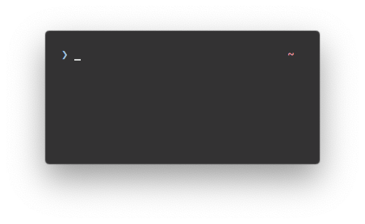

# `>_` typewritten - a minimal zsh prompt theme

Leaves all the room for what's important.

<p align="center">
  
</p>

> Terminal is [iTerm2](https://iterm2.com/) — Font is [JetBrains Mono](https://www.jetbrains.com/lp/mono/) — Terminal theme is [Seoul256](https://github.com/junegunn/seoul256.vim)

## Features

- Current directory
- Current git branch
- [git status indicators](#git-status-indicators)
- [Return code](#return-code)
- [Various customization options](#customization-options)
  - [Prompt layout](#typewritten_prompt_layout)
  - [Prompt symbol](#typewritten_symbol)
  - [Constant display of git home directory](#typewritten_git_relative_path)
  - [Cursor](#typewritten_cursor)
  - [Prefix on right prompt](#typewritten_right_prompt_prefix)

## Quick start

### Manual

Clone the typewritten repository somewhere you can easily link. I recommend creating a `.zsh` directory at root.

```shell
mkdir -p "$HOME/.zsh"
git clone https://github.com/reobin/typewritten.git "$HOME/.zsh/typewritten"
```

Load typewritten in your `.zshrc` by using zsh prompinit:

```shell
fpath+=$HOME/.zsh/typewritten
autoload -U promptinit; promptinit
prompt typewritten
```

Note: if using `oh-my-zsh`, set `ZSH_THEME=""` in your `.zshrc` to disable oh-my-zsh themes.

### [oh-my-zsh](https://github.com/robbyrussell/oh-my-zsh)

Clone the repository into your custom oh-my-zsh themes directory:

```shell
git clone https://github.com/reobin/typewritten.git $ZSH_CUSTOM/themes/typewritten
```

Symlink `typewritten.zsh-theme` to your oh-my-zsh custom themes directory:

```shell
ln -s "$ZSH_CUSTOM/themes/typewritten/typewritten.zsh-theme" "$ZSH_CUSTOM/themes/typewritten.zsh-theme"
```

Set `ZSH_THEME="typewritten"` in your `.zshrc` file.

### [antibody](https://github.com/getantibody/antibody)

Add `antibody bundle reobin/typewritten` to your `.zshrc`.

### [zgen](https://github.com/tarjoilija/zgen)

Add `zgen load reobin/typewritten typewritten` to your `.zshrc`.

### [zim](https://github.com/Eriner/zim)

Add `zmodule reobin/typewritten --name typewritten` to your `.zimrc` and run `zimfw install`.

### [zplug](https://github.com/zplug/zplug)

Add `zplug reobin/typewritten, as:theme` to your `.zshrc`.

## Customization options

Click on an option's name to see more info.

| Option                                                                | Description                                                                                        | Available options                                   | Default value |
| --------------------------------------------------------------------- | -------------------------------------------------------------------------------------------------- | --------------------------------------------------- | ------------- |
| [`TYPEWRITTEN_PROMPT_LAYOUT`](#typewritten_prompt_layout)             | Defines how the prompt is displayed.                                                               | `singleline`, `singleline_verbose`, and `multiline` | `singleline`  |
| [`TYPEWRITTEN_SYMBOL`](#typewritten_symbol)                           | Defines the prompt symbol.                                                                         | Any string value                                    | `>`           |
| [`TYPEWRITTEN_GIT_RELATIVE_PATH`](#typewritten_git_relative_path)     | If `true`, the current git home directory name is always shown next to the current directory name. | `true` or `false`                                   | `false`       |
| [`TYPEWRITTEN_CURSOR`](#typewritten_cursor)                           | Defines the used cursor.                                                                           | `underscore`, `beam`, or `block`                    | `underscore`  |
| [`TYPEWRITTEN_RIGHT_PROMPT_PREFIX`](#typewritten_right_prompt_prefix) | Defines what is displayed just before the right part of the prompt.                                | Any string                                          |               |

> All of these options are configurable through your `.zshrc` file like this:
>
> ```shell
> export TYPEWRITTEN_PROMPT_LAYOUT="singleline"
> ```

### `TYPEWRITTEN_PROMPT_LAYOUT`

**Default single line (`TYPEWRITTEN_PROMPT_LAYOUT="singleline"`)**

<p align="center">
  
</p>

**Single line - verbose variation (`TYPEWRITTEN_PROMPT_LAYOUT="singleline_verbose"`)**

<p align="center">
  
</p>

**Multiline (`TYPEWRITTEN_PROMPT_LAYOUT="multiline"`)**

<p align="center">
  
</p>

### `TYPEWRITTEN_SYMBOL`

Here are some examples of customized prompt symbols.

**Default (`TYPEWRITTEN_SYMBOL="❯"`)**

<p align="center">
  
</p>

**Dollar sign (`TYPEWRITTEN_SYMBOL="$"`)**

<p align="center">
  
</p>

**Full arrow (`TYPEWRITTEN_SYMBOL="->"`)**

<p align="center">
  
</p>

### `TYPEWRITTEN_GIT_RELATIVE_PATH`

By default, the git root directory is always displayed no matter how far you are inside it.
To turn it off and display only the current directory, set `TYPEWRITTEN_GIT_RELATIVE_PATH` to `false`.

**Default behaviour (`TYPEWRITTEN_GIT_RELATIVE_PATH=true`)**

`/.../` is displayed when the nesting gets more than one level deep.

<p align="center">
  
</p>

**Hide git home direcoty (`TYPEWRITTEN_GIT_RELATIVE_PATH=false`)**

<p align="center">
  
</p>

### `TYPEWRITTEN_CURSOR`

**Default underscore (`TYPEWRITTEN_CURSOR="underscore"`)**

<p align="center">
  
</p>

**Beam (`TYPEWRITTEN_CURSOR="beam"`)**

<p align="center">
  
</p>

**Block (`TYPEWRITTEN_CURSOR="block"`)**

<p align="center">
  
</p>

### `TYPEWRITTEN_RIGHT_PROMPT_PREFIX`

**Bash comment prefix (`TYPEWRITTEN_RIGHT_PROMPT_PREFIX="# "`)**

<p align="center">
  
</p>

## More info

### git status indicators

- `?` &nbsp; — untracked change(s);
- `+` &nbsp; — staged change(s);
- `!` &nbsp; — file(s) modified in the repo;
- `»` &nbsp; — renamed file(s);
- `—` &nbsp; — deleted file(s);
- `$` &nbsp; — stashed change(s);
- `#` &nbsp; — unmerged change(s);
- `•|` &nbsp; — behind of remote branch;
- `|•` &nbsp; — ahead of remote branch;
- `~` &nbsp; — Branches have diverged;

Git status can be disabled by setting `git config` value in a repo or globally like so:

```bash
git config --add oh-my-zsh.hide-status 1
```

### return code

When an error happens, the prompt symbol changed to a red color, and the return code is displayed on the left.

<p align="center">
  
</p>

## Credits

A special thanks to all the contributors to this project

- [@thbe](https://github.com/thbe)
- [@erikr](https://github.com/erikr)
- [@artem-zinnatullin](https://github.com/artem-zinnatullin)
- [@nizarmah](https://github.com/nizarmah)
- [@jletey](https://github.com/jletey)
